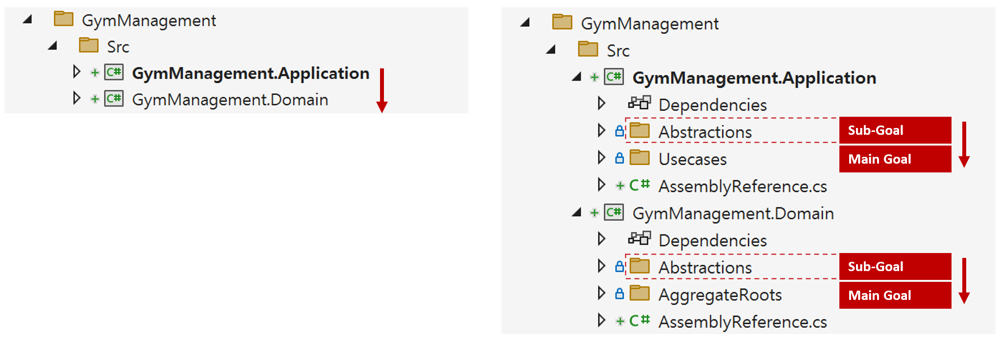

# Domain-Driven Design Basic

> '[Getting Started: Domain-Driven Design](https://dometrain.com/course/getting-started-domain-driven-design-ddd/?ref=dometrain-github&promo=getting-started-domain-driven-design)'를 기반으로 재구성되었습니다.

## Goal
- 지속 가능한 소프트웨어 개발을 위한 코드 구성 방법을 이해한다.
- 도메인 지식을 코드로 표현하는 설계 패턴을 학습니다.

## Table of Contents
- Part 1. 비즈니스 관점
  - [ ] Chapter 1. 도메인 탐색
  - [ ] Chapter 2. 깊은 도메인 탐색
  - [ ] Chapter 3. 유스케이스
- Part 2. 기술 관심사
  - [ ] Chapter 4. 인프라스트럭처(WebApi)
  - [ ] Chapter 5. 인프라스트럭처(Container)
  - [ ] Chapter 6. 인프라스트럭처(RabbitMQ)
  - [ ] Chapter 7. 영속성(Db)
  - [ ] Chapter 8. 서비스

## 솔루션 설계 원칙

- **분리(Separation )**
  - **괸심사(Concerns)**: `비즈니스 관심사` vs `기술 관심사`
  - **목표(Goals)**: `주 목표` vs `부수 목표`(주가 되는 것에 붙어 따르는 것)
- **방향(Direction)**
  - **위(Up)**: 기술 관점에서 더 중요한 요소(부수 목표)
  - **아래(Down)**: 비즈니스 관점에서 더 중요한 요소(주 목표)  

| 방향  | 관심사의 분리 | 목표의 분리                         |
| --- | --- | --- |
| 위(Up)      | 기술 관심사(무한)   | 부수 목표(무한 -Abstractions-> 유한)   |
| 아래(Down)  | 비즈니스 관심사(유한)    | 주 목표(유한)     |

- 부수 목표의 무한성을 유한으로 전환하기 위해 `Abstractions` 상위 폴더를 도입하고, 그 아래 하위 폴더에 무한한 부수 목표를 배치합니다.
- 이를 통해 부수 목표가 주 목표와 명확히 분리되며, 상단(위)에 배치된 Abstractions 폴더를 제외한 모든 폴더가 주 목표로 더욱 직관적으로 이해될 수 있습니다

```
{T}
├─Src
│  ├─{T}                          // Host               > 위(Up): 기술 관점에서 더 중요한 요소(부수 목표)
│  ├─{T}.Adapters.Infrastructure  // Adapter Layer      > │
│  ├─{T}.Adapters.Persistence     // Adapter Layer      > │
│  ├─{T}.Application              // Application Layer  > ↓
│  └─{T}.Domain                   // Domain Layer       > 아래(Down): 비즈니스 관점에서 더 중요한 요소(주 목표)
│     ├─Abstractions                                    > 위(Up): 기술 관점에서 더 중요한 요소(부수 목표)
│     │                                                 > ↓
│     └─AggregateRoots                                  > 아래(Down): 비즈니스 관점에서 더 중요한 요소(주 목표)
│
└─Tests
   ├─{T}..Tests.Integration       // Integration Test   > 위(Up): 기술 관점에서 더 중요한 요소(부수 목표)
   ├─{T}..Tests.Performance       // Performance Test   > ↓
   └─{T}..Tests.Unit              // Unit Test          > 아래(Down): 비즈니스 관점에서 더 중요한 요소(주 목표)
```


